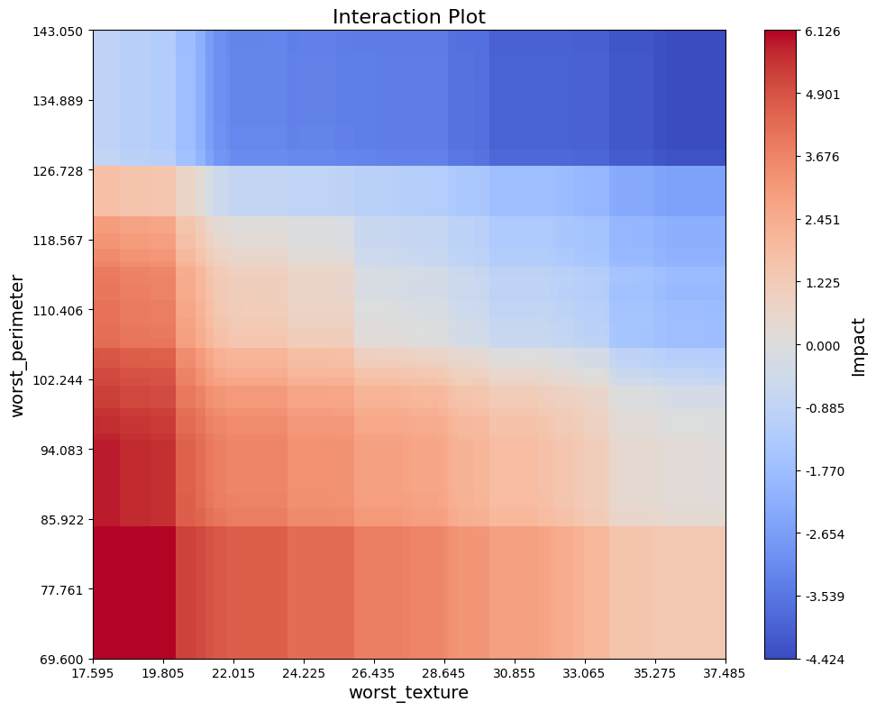
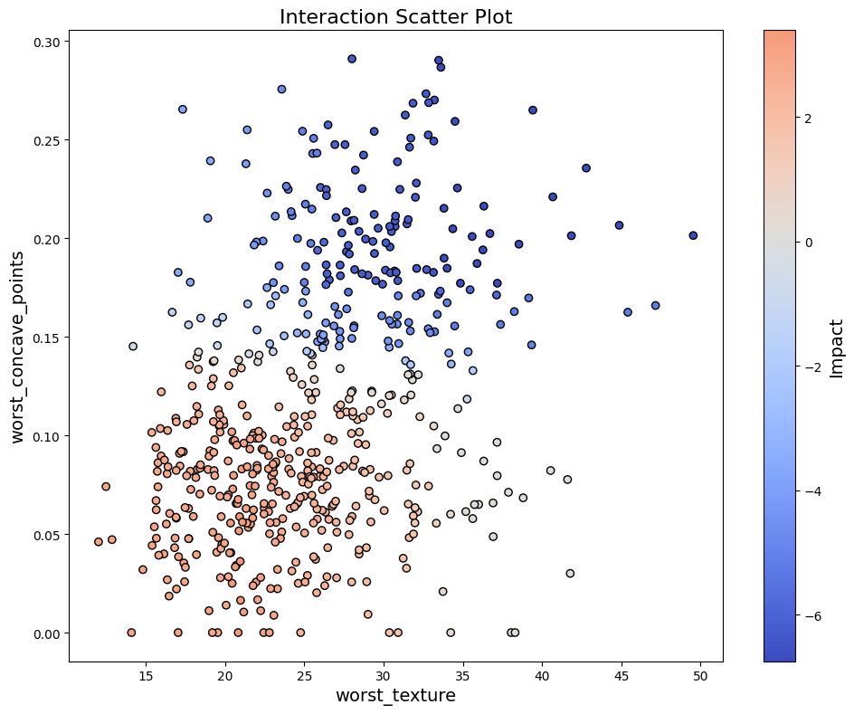
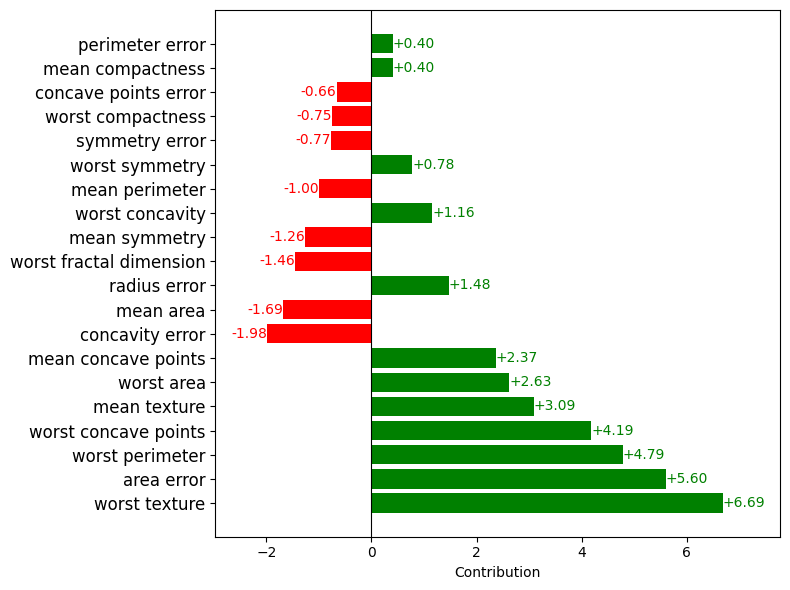

Usage
======

This example demonstrates how to set up and use the ``Explainer`` with a basic ``lightgbm`` model trained on the Breast Cancer dataset. 
Note that similar configurations can be applied to other models,  ``Explainer`` is also  compatible with ``XGBoost``  and ``CatBoost``.

For detailed information, please refer to the `API Reference <api_reference.html#api_reference>`_.

Setup Code
----------

.. code-block:: python

    from lightgbm import LGBMClassifier
    from sklearn.datasets import load_breast_cancer
    from sklearn.model_selection import train_test_split

    from treemind import Explainer
    from treemind.plot import (
        bar_plot,
        feature_plot,
        interaction_plot,
        interaction_scatter_plot,
    )

    # Load the dataset
    X, y = load_breast_cancer(return_X_y=True, as_frame=True)

    # Train the model
    model = LGBMClassifier(verbose=-1)
    model.fit(X, y)

Once the model is trained, it is ready to be analyzed with the ``Explainer``.

Initializing the ``Explainer``
------------------------------

After training the model, initialize the ``Explainer`` by calling it with the model object:

.. code-block:: python

    explainer = Explainer()
    explainer(model)

Counting Feature Appearances 
----------------------------

The ``count_node`` function analyzes how often individual features or pairs of features appear in decision splits across the model's trees. This analysis can help identify the most influential features or feature interactions in the model's decision-making process.

To count individual feature appearances in splits:

.. code-block:: python

    explainer.count_node(order=1)

.. code-block:: none

    column_index  count
    21            1739
    27            1469
    22            1422
    23            1323
     1            1129

To count feature-pair interactions in splits:

.. code-block:: python

    explainer.count_node(order=2)

.. code-block:: none

    column1_index  column2_index  count
    21             22             927
    21             23             876
    21             27             852
     1             27             792
    23             27             734

Analyzing Specific Feature
----------------------------

The ``analyze_feature`` function calculates statistical metrics for a specific feature based on its split points across the model's trees. 
This analysis helps in understanding the distribution and impact of a single feature across different split points.

To analyze a specific feature by its index (e.g., 21), use:

.. code-block:: python

    feature_df = explainer.analyze_feature(21)

.. code-block:: none

    worst_texture_lb  worst_texture_ub   mean        min       max
    -inf              15.470             8.535704   -3.632846   10.822743
    15.470            17.710             8.536465   -3.632846   10.822743
    17.710            17.825             8.557027   -3.632846   10.822743
    17.825            18.460             8.553872   -3.632846   10.822743
    18.460            19.415             8.429304   -3.849259   10.822743

To visualize feature statistics calculated by ``analyze_feature`` using ``feature_plot``:

.. code-block:: python

    feature_plot(feature_df)

.. image:: _static/example/feature_plot.png
    :alt: Feature plot visualizing statistical metrics for a feature
    :align: center
    :width: 80%

The ``feature_plot`` function plots the values of a specific feature based on split points across trees.

Analyzing Feature Interactions
------------------------------

The ``analyze_feature`` function given multiple indices calculates the dependency between two or more features by examining their split points across the model’s trees. 

To analyze an interaction between two features (e.g., feature indices 21 and 22), use:

.. code-block:: python

    df = explainer.analyze_feature([21, 22])

Example output:

.. code-block:: none

    worst_texture_lb  worst_texture_ub  worst_perimeter_lb  worst_perimeter_ub   value
    -inf              17.710            -inf                71.06                6.111742
    17.710            17.825            -inf                71.06                6.126359
    17.825            18.460            -inf                71.06                6.125672
    18.460            19.415            -inf                71.06                6.125672
    19.415            20.225            -inf                71.06                6.125672

To visualize interactions between two features calculated by ``analyze_interaction`` using ``interaction_plot``:

.. code-block:: python

    interaction_plot(df)

The ``interaction_plot`` function visualizes feature interactions by creating a filled rectangle plot. The plot uses model split points to 
display intervals, with color intensity representing the interaction values.

To visualize interactions between two features on given data by ``analyze_interaction`` using ``interaction_scatter_plot``:

.. code-block:: python

    interaction_scatter_plot(X, df, 21, 22)

The ``interaction_scatter_plot`` function visualizes feature interactions reflected on given data.

Analyzing Feature Contributions on Data
---------------------------------------
The ``analyze_data`` function in the ``Explainer`` takes input data and computes feature contributions toward a target prediction. This function 
allows you to analyze feature contributions for a single data point (row) or across the entire dataset, providing insights into the effect 
of each feature on the model's predictions in both classification and regression tasks.

For analyzing contributions across the entire dataset ``X``, use:

.. code-block:: python

    values = explainer.analyze_data(X)

To inspect feature contributions for a specific row, e.g., ``X.iloc[5, :]``, use the following code:

.. code-block:: python

    values = explainer.analyze_data(X.iloc[[5], :])

To visualize the feature contributions using ``bar_plot``:

.. code-block:: python

    bar_plot(values, columns=X.columns)

This bar plot presents each feature's contribution, showing the positive or negative impact 
on the prediction. If column names (``columns``) are not specified, ``bar_plot`` will generate 
default names based on feature indices. If values contains more than single row, then results will
be mean of their absolute values.