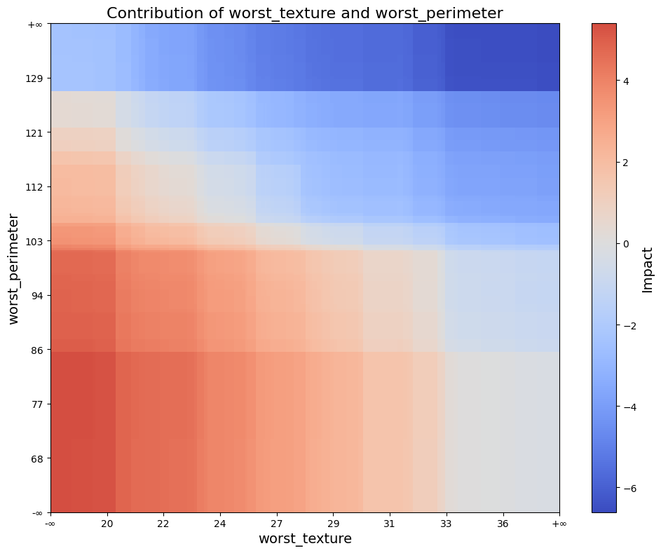
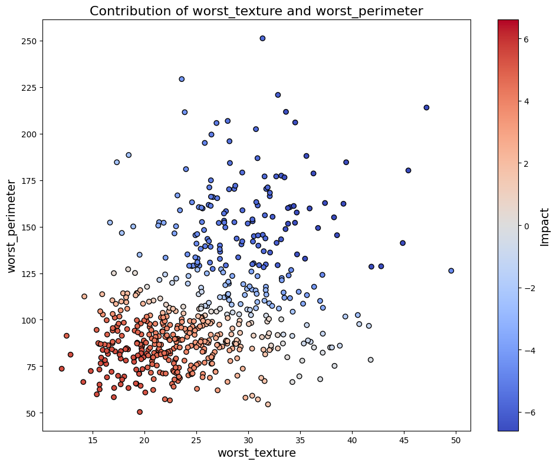

Usage
======

This example demonstrates how to configure and use the ``Explainer`` with a simple ``lightgbm`` model trained on the Breast Cancer dataset.  
The ``Explainer`` is compatible not only with ``lightgbm`` but also with ``xgboost``, ``catboost``, ``sklearn``, and ``perpetual`` models.

For more detailed information, please refer to the :ref:`API Reference <api_reference>`.

Setup Code
----------

.. code-block:: python

    from lightgbm import LGBMClassifier
    from sklearn.datasets import load_breast_cancer
    from sklearn.model_selection import train_test_split

    from treemind import Explainer
    from treemind.plot import (
        feature_plot,
        interaction_plot,
        interaction_scatter_plot,
        importance_plot
    )

    # Load the dataset
    X, y = load_breast_cancer(return_X_y=True, as_frame=True)

    # Train a LightGBM model
    model = LGBMClassifier(verbose=-1)
    model.fit(X, y)

Once the model has been trained, it can be analyzed using the ``Explainer``.

Initializing the ``Explainer``
------------------------------

After training, initialize the ``Explainer`` with the model:

.. code-block:: python

    explainer = Explainer(model)

Counting Feature Appearances 
----------------------------

The ``count_node`` method analyzes how frequently features (or feature pairs) are used in the model's decision splits.  
This is useful for identifying which features most influence the model's predictions.

To count how often each individual feature appears in splits:

.. code-block:: python

    explainer.count_node(degree=1)

.. code-block:: text

    | column_index | count |
    |--------------|-------|
    | 21           | 1739  |
    | 27           | 1469  |
    | 22           | 1422  |
    | 23           | 1323  |
    | 1            | 1129  |

To analyze feature-pair interactions in splits:

.. code-block:: python

    explainer.count_node(degree=2)

.. code-block:: text

    | column1_index | column2_index | count |
    |---------------|---------------|-------|
    | 21            | 22            | 927   |
    | 21            | 23            | 876   |
    | 21            | 27            | 852   |
    | 1             | 27            | 792   |
    | 23            | 27            | 734   |

Analyzing Features
----------------------------

The ``explain`` function generates a ``Result`` object that summarizes statistical metrics for individual features or feature interactions based on the model’s decision splits.

To perform a one-dimensional (single feature) analysis:

.. code-block:: python

    result1_d = explainer.explain(degree=1)

To perform a two-dimensional (feature interaction) analysis:

.. code-block:: python

    result2_d = explainer.explain(degree=2)

The returned ``Result`` objects (``result1_d`` and ``result2_d``) contain computed statistics across the model’s decision trees. You can index into them to inspect metrics for a specific feature or feature pair.

One-Dimensional Feature Analysis
^^^^^^^^^^^^^^^^^^^^^^^^^^^^^^^^

To access the analysis for a particular feature (e.g., feature index 21):

.. code-block:: python

    result1_d[21]

.. code-block:: text

    | worst_texture_lb | worst_texture_ub |   value   |   std    |  count  |
    |------------------|------------------|-----------|----------|---------|
    | -inf             | 18.460           | 3.185128  | 8.479232 | 402.24  |
    | 18.460           | 19.300           | 3.160656  | 8.519873 | 402.39  |
    | 19.300           | 19.415           | 3.119814  | 8.489262 | 401.85  |
    | 19.415           | 20.225           | 3.101601  | 8.490439 | 402.55  |
    | 20.225           | 20.360           | 2.772929  | 8.711773 | 433.16  |

To visualize the result of a specific feature:

.. code-block:: python

    feature_plot(result1_d, 21)

.. image:: _static/api/feature_plot.png
    :alt: Feature plot visualizing statistical metrics for a feature
    :align: center
    :width: 80%

To retrieve the importance scores as a DataFrame:

.. code-block:: python

    result1_d.importance()

.. code-block:: text

    |   feature_0            |  importance |
    |------------------------|-------------|
    | worst_concave_points   |   2.326004  |
    | worst_perimeter        |   2.245493  |
    | worst_area             |   1.943674  |
    | mean_concave_points    |   1.860428  |
    | worst_texture          |   1.452654  |

To visualize feature importance:

.. code-block:: python

    importance_plot(result1_d)

Two-Dimensional Feature Interaction Analysis
^^^^^^^^^^^^^^^^^^^^^^^^^^^^^^^^^^^^^^^^^^^^^

To inspect interaction effects between two features (e.g., indices 21 and 22):

.. code-block:: python

    result2_d[21, 22]

.. code-block:: text

    | worst_texture_lb | worst_texture_ub | worst_concave_points_lb | worst_concave_points_ub |   value   |   std    |  count  |
    |------------------|------------------|--------------------------|--------------------------|-----------|----------|---------|
    | -inf             | 18.46            | -inf                     | 0.058860                 | 4.929324  | 7.679424 | 355.40  |
    | -inf             | 18.46            | 0.058860                 | 0.059630                 | 4.928594  | 7.679772 | 355.34  |
    | -inf             | 18.46            | 0.059630                 | 0.065540                 | 4.923128  | 7.679783 | 355.03  |
    | -inf             | 18.46            | 0.065540                 | 0.069320                 | 4.912888  | 7.682064 | 354.70  |
    | -inf             | 18.46            | 0.069320                 | 0.069775                 | 4.912888  | 7.682064 | 354.70  |

To retrieve importance scores from the two-dimensional result:

.. code-block:: python

    result2_d.importance()

.. code-block:: text

    |       feature_0         |       feature_1        | importance |
    |-------------------------|------------------------|------------|
    | worst_perimeter         | worst_area             | 2.728454   |
    | worst_perimeter         | worst_concave_points   | 2.583406   |
    | worst_area              | worst_concave_points   | 2.533335   |
    | worst_texture           | worst_concave_points   | 2.439605   |
    | worst_texture           | worst_perimeter        | 2.434743   |

To visualize the importance of feature interactions:

.. code-block:: python

    importance_plot(result2_d)

.. image:: _static/api/importance_plot2d.png
    :alt: Importance plot visualizing feature interaction importance values
    :align: center
    :width: 80%

To visualize specific interactions using ``interaction_plot``:

.. code-block:: python

    interaction_plot(result2_d, (21, 22))

The ``interaction_plot`` creates a filled rectangle visualization using model split intervals, where color intensity reflects interaction strength.

To visualize interaction effects over actual data points:

.. code-block:: python

    interaction_scatter_plot(X, result2_d, (21, 22))

The ``interaction_scatter_plot`` overlays interaction scores on real input data to reveal how feature interactions manifest in the dataset.
