Experiment 3
============

.. code-block:: python

   target = (
      transformed_0 * transformed_1 * transformed_2 * transformed_3
      + np.random.normal(loc=0, scale=0.2, size=n_samples)
    )

Interaction Analysis
^^^^^^^^^^^^^^^^^^^^^

feature_0 - feature_1 
"""""""""""""""""""""

**Prediction plot:**  

**Function plot:**  

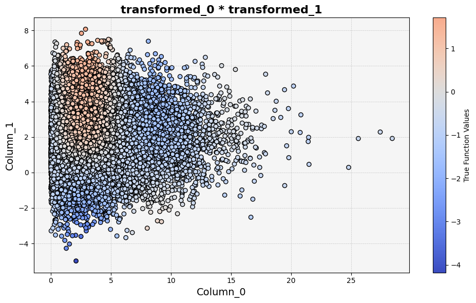

**treemind plot:**  

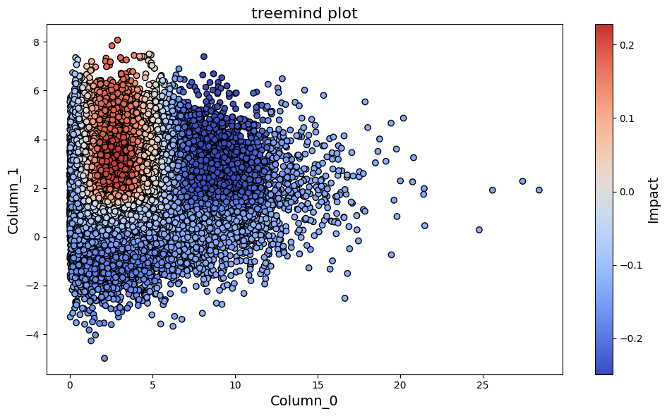

**SHAP plot:**  

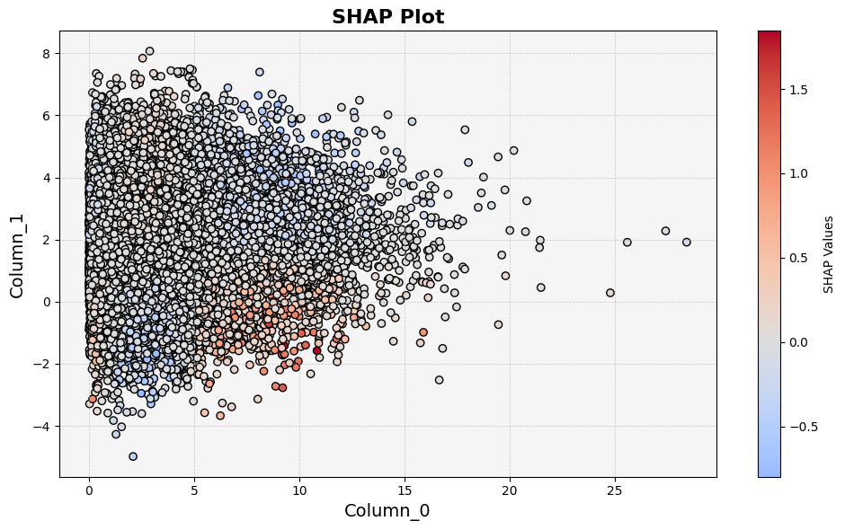

feature_0 - feature_2 
"""""""""""""""""""""

**Prediction plot:**  

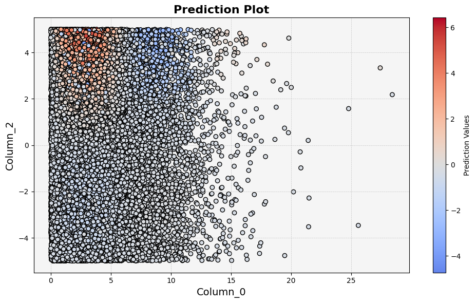

**Function plot:**  

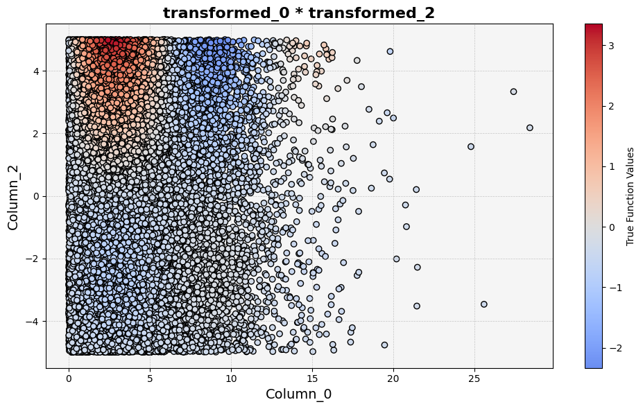

**treemind plot:**  

**SHAP plot:**  

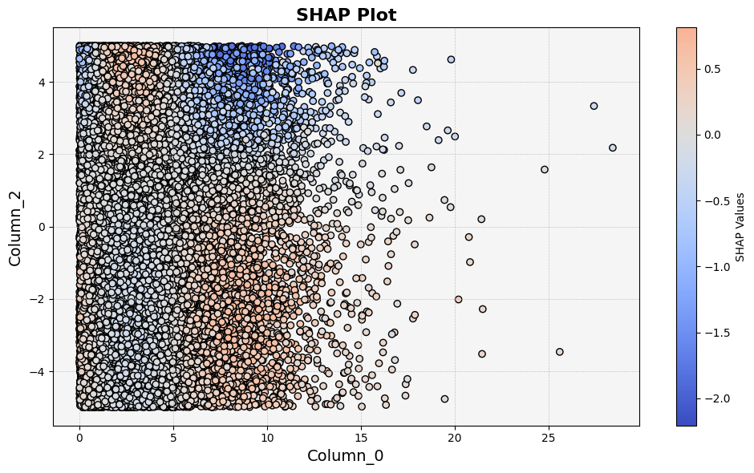

feature_0 - feature_3
"""""""""""""""""""""

**Prediction plot:**  

**Function plot:**  

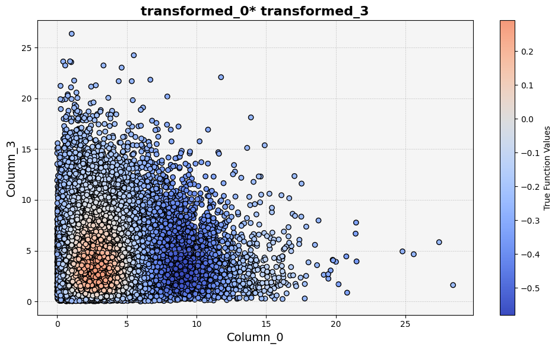

**treemind plot:**  

**SHAP plot:**  

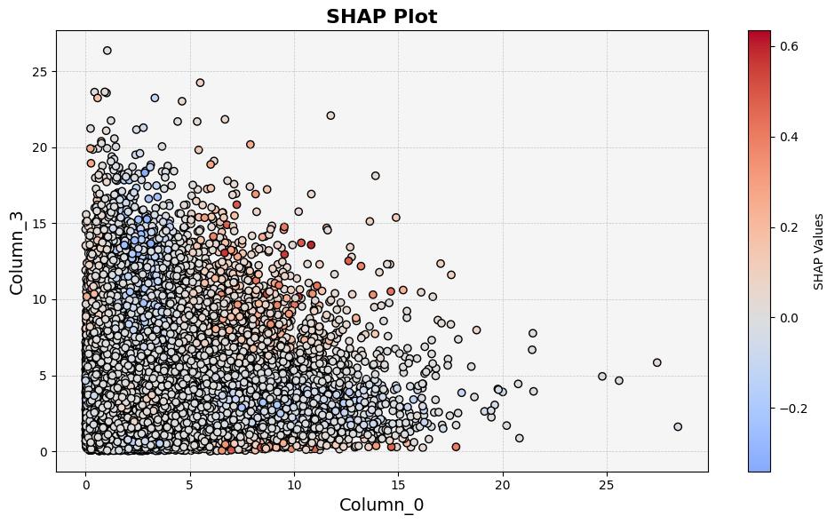

feature_1 - feature_2
"""""""""""""""""""""

**Prediction plot:**  

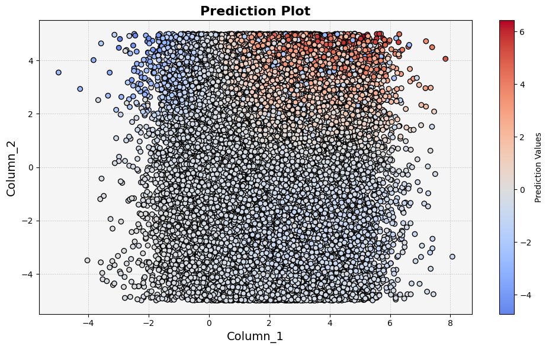

**Function plot:**  

**treemind plot:**  

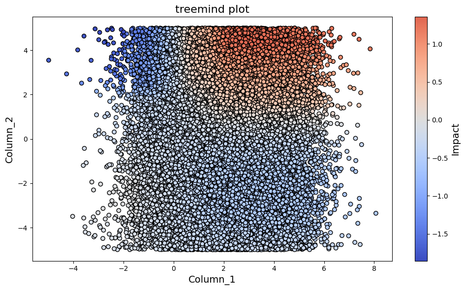

**SHAP plot:**  

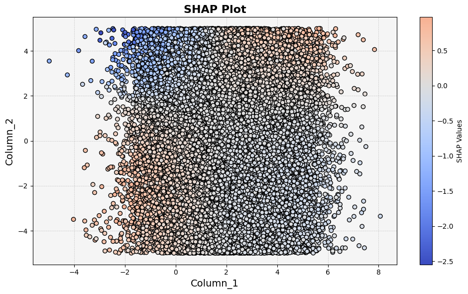

feature_1 - feature_3
"""""""""""""""""""""

**Prediction plot:**  

**Function plot:**  

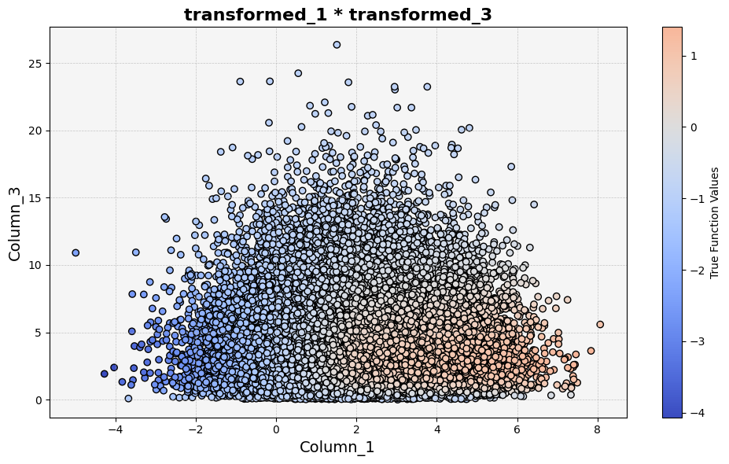

**treemind plot:**  

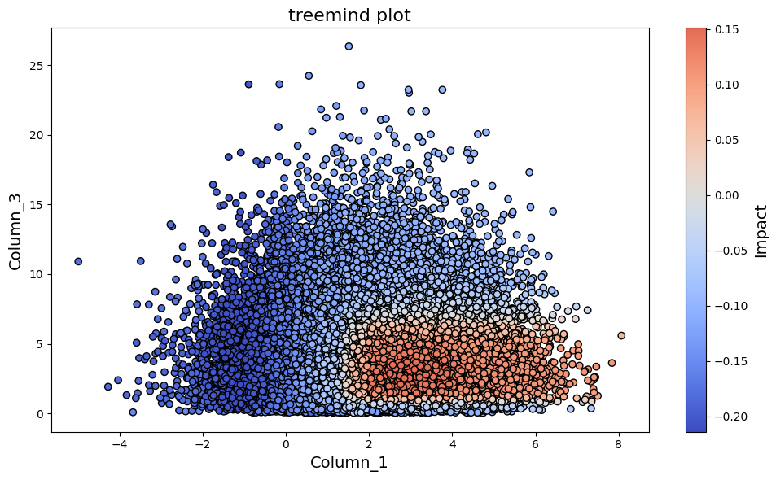

**SHAP plot:**  

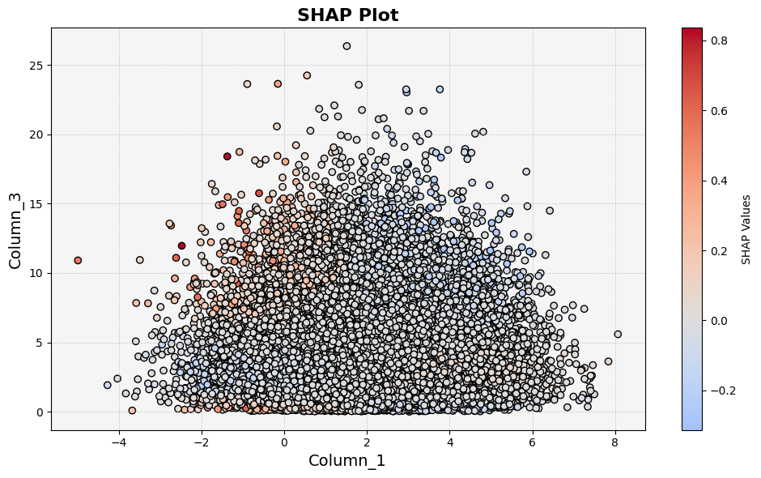

feature_2 - feature_3
"""""""""""""""""""""

**Prediction plot:**  

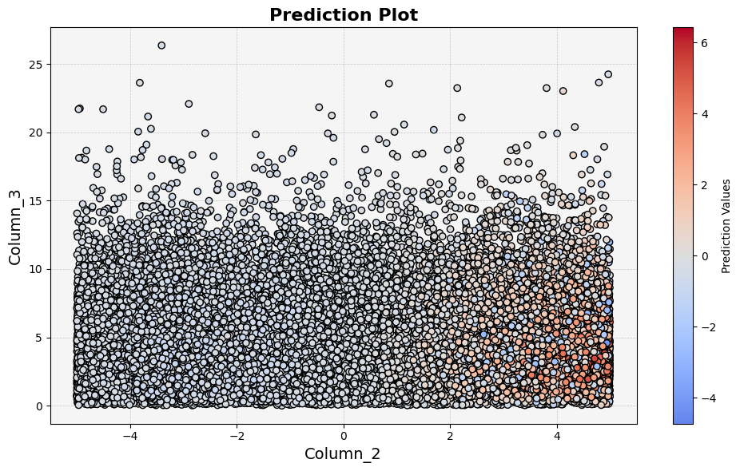

**Function plot:**  

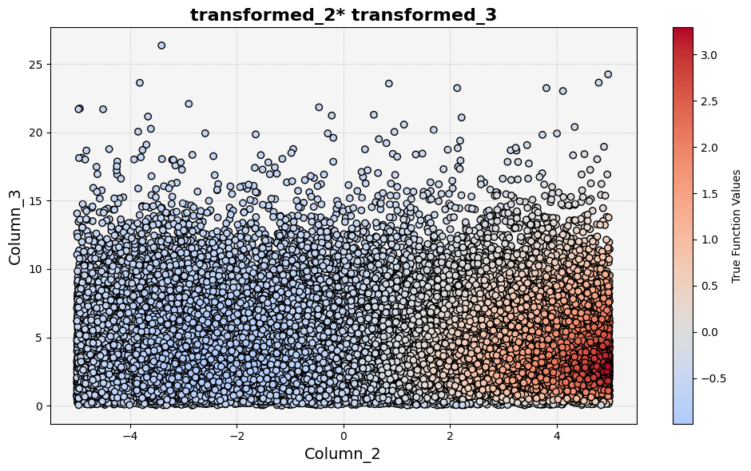

**treemind plot:**  

**SHAP plot:**  

.. image:: ../_static/experiments/experiment_3/interaction_2_3_shap.png  
   :alt: SHAP interaction values between feature 2 and feature 3
   :width: 600px  