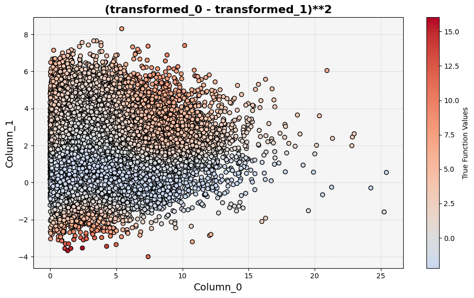
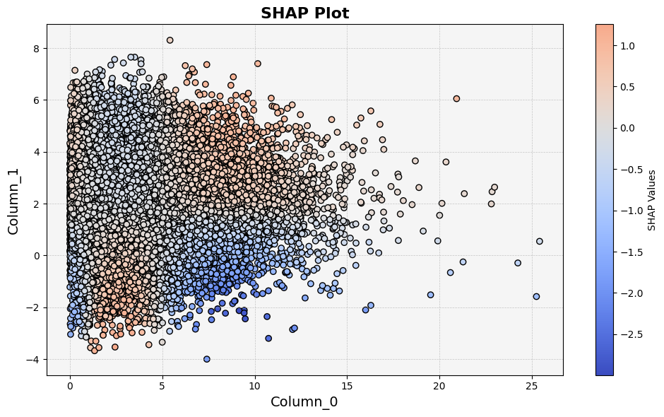
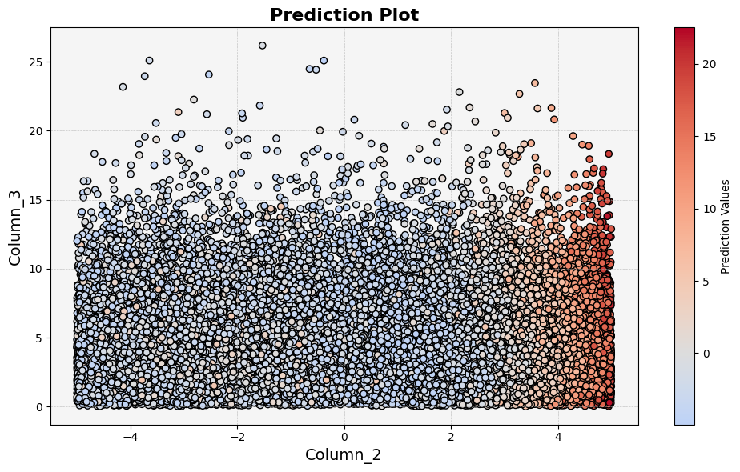
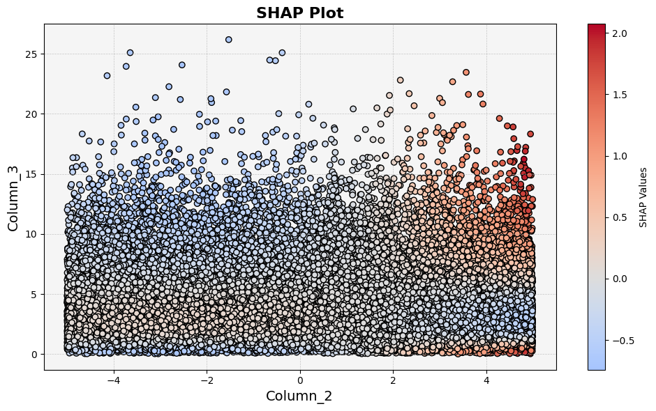

Experiment 4
============

.. code-block:: python

   target = (
      (transformed_0 - transformed_1) ** 2
      + (transformed_2 - transformed_3) ** 2
      + np.random.normal(loc=0, scale=0.2, size=n_samples)
   )

Interaction Analysis
^^^^^^^^^^^^^^^^^^^^^

feature_0 - feature_1 
"""""""""""""""""""""

**Prediction plot:**  

**Function plot:**  

**treemind plot:**  

**SHAP plot:**  

feature_2 - feature_3
"""""""""""""""""""""

**Prediction plot:**  

**Function plot:**  

**treemind plot:**  

**SHAP plot:**  

