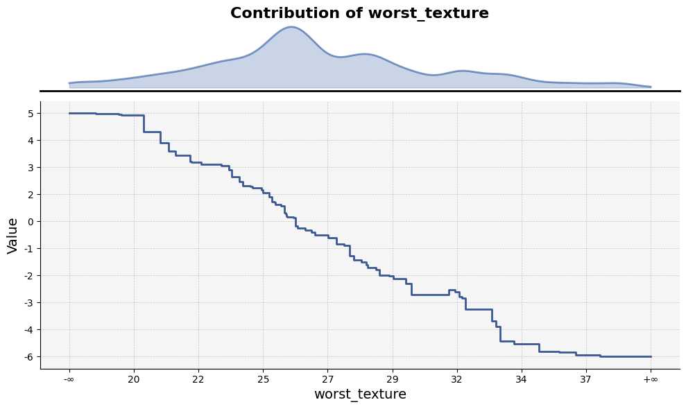
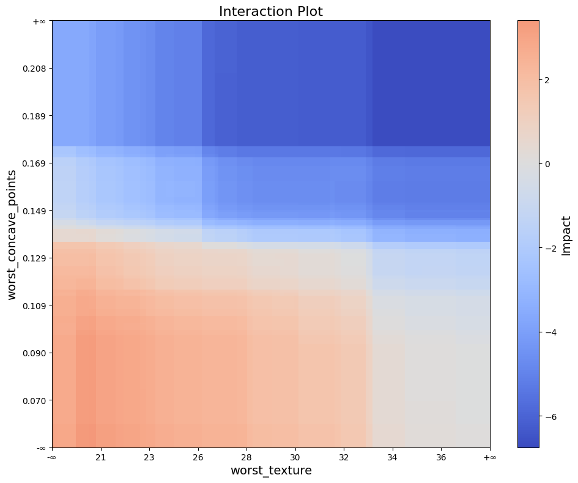
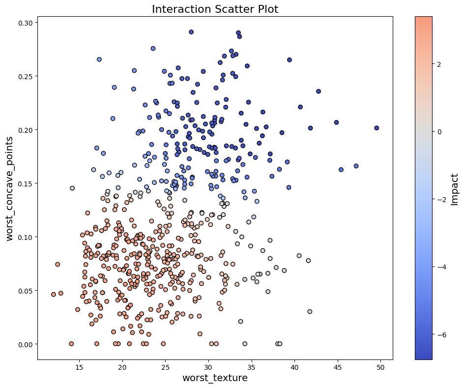
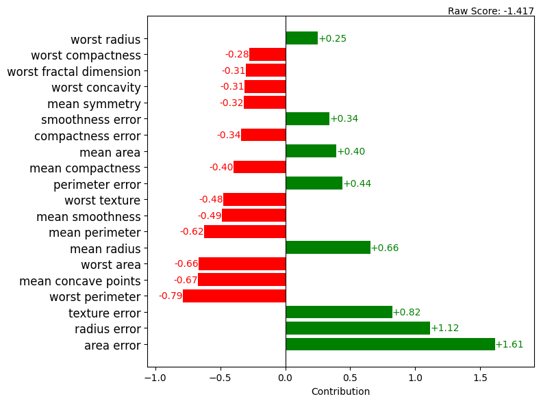

``treemind.plot``
=================

.. automodule:: treemind.plot

.. autofunction:: treemind.plot.feature_plot

**Example Usage**

Below is an example of how to use the `feature_plot` function:

.. code-block:: python

    from treemind import Explainer
    from treemind.plot import feature_plot

    # Assume 'model' is a trained LightGBM or XGBoost or CatBoost model object

    # Create an instance of the Explainer
    explainer = Explainer()
    explainer(model)

    # Analyze the specified feature by its index
    df = tree.analyze_feature(22)

    # Plot the feature using a line plot
    feature_plot(df)

**Output**

.. autofunction:: treemind.plot.interaction_plot

**Example Usage**

Below is an example of how to use the `interaction_plot` function:

.. code-block:: python

    from treemind import Explainer
    from treemind.plot import interaction_plot

    # Assume 'model' is a trained LightGBM or XGBoost or CatBoost model object

    # Create an instance of the Explainer
    explainer = Explainer()
    explainer(model)

    # Analyze the specified feature by its index
    df = tree.analyze_feature([22,21])

    # Plot the feature using a line plot
    interaction_plot(df)

**Output**

.. autofunction:: treemind.plot.interaction_scatter_plot

**Example Usage**

Below is an example of how to use the `interaction_scatter_plot` function:

.. code-block:: python

    from treemind import Explainer
    from treemind.plot import interaction_scatter_plot

    # Assume 'model' is a trained LightGBM or XGBoost or CatBoost model object

    # Create an instance of the Explainer
    explainer = Explainer()
    explainer(model)

    # Analyze the specified feature by its index
    df = tree.analyze_feature([22,21])

    # Plot the feature using a line plot
    interaction_scatter_plot(X, df, 22, 21)

**Output**

.. autofunction:: treemind.plot.bar_plot

**Example Usage**

Below is an example of how to use the `bar_plot` function:

.. code-block:: python

    from treemind import Explainer
    from treemind.plot import bar_plot

    # Assume 'model' is a trained LightGBM or XGBoost or CatBoost model object

    # Create an explainer instance
    explainer = Explainer()
    explainer(model)

    # Analyze the entire dataset
    values = explainer.analyze_data(X)

    # Alternatively, analyze a single row
    # values = explainer.analyze_data(X.iloc[10, :])

    # Plot the feature importance using a bar plot
    bar_plot(values, columns=X_train.columns)

**Output**

