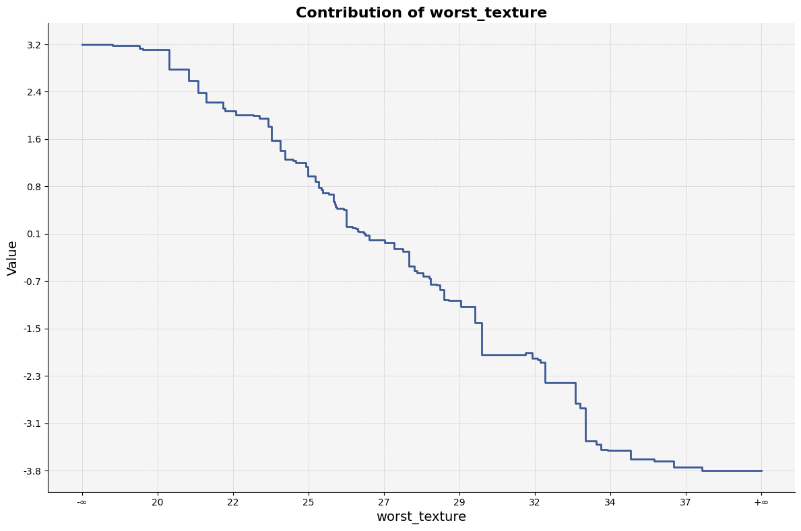

``treemind.plot``
=================

.. autofunction:: treemind.plot.feature_plot

**Example Usage**

Below is an example of how to use the `feature_plot` function:

.. code-block:: python

    from treemind import Explainer
    from treemind.plot import feature_plot

    # Assume 'model' is a trained tree model

    # Create an instance of the Explainer
    explainer = Explainer(model)

    # Analyze the specified feature by its index
    result = explainer.explain(degree=1)

    # Plot the feature using a line plot
    feature_plot(result, 22)

**Output**

.. autofunction:: treemind.plot.interaction_plot

**Example Usage**

Below is an example of how to use the `interaction_plot` function:

.. code-block:: python

    from treemind import Explainer
    from treemind.plot import interaction_plot

    # Assume 'model' is a trained tree model

    # Create an instance of the Explainer
    explainer = Explainer(model)

    # Analyze the specified feature by its index
    result = explainer.explain(degree=2)

    # Plot the feature using a line plot
    interaction_plot(result, (22, 21))

**Output**

.. image:: _static/api/interaction_plot.png
    :alt: interaction_plot example

.. autofunction:: treemind.plot.interaction_scatter_plot

**Example Usage**

Below is an example of how to use the `interaction_scatter_plot` function:

.. code-block:: python

    from treemind import Explainer
    from treemind.plot import interaction_scatter_plot

    # Assume 'model' is a trained tree model

    # Create an instance of the Explainer
    explainer = Explainer(model)

    # Analyze the specified feature by its index
    result = explainer.explain(degree=2)

    # Plot the feature using a line plot
    interaction_scatter_plot(X, result, (22, 21))

**Output**

.. image:: _static/api/interaction_scatter_plot.png
    :alt: interaction_scatter_plot example

.. autofunction:: treemind.plot.importance_plot

**Example Usage**

Below is an example of how to use the `importance_plot` function:

.. code-block:: python

    from treemind import Explainer
    from treemind.plot import importance_plot

    # Assume 'model' is a trained tree model

    # Create an instance of the Explainer
    explainer = Explainer(model)

    # Analyze the specified feature by its index
    result = explainer.explain(degree=1)

    # Plot the feature using a line plot
    importance_plot(result)
    

**Output**

.. image:: _static/api/interaction_scatter_plot.png
    :alt: interaction_scatter_plot example

