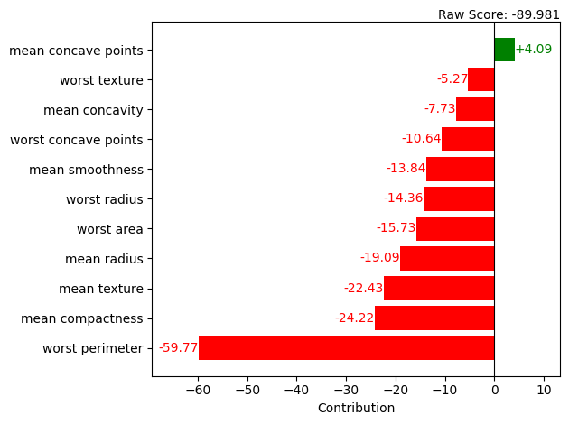

bar_plot
========

.. autofunction:: treemind.plot.bar_plot
    :no-index:

**Example Usage**

Below is an example of how to use the `bar_plot` function:

.. code-block:: python

    from treemind import Explainer
    from treemind.plot import bar_plot

    # Assume 'model' is a trained LightGBM or XGBoost model object

    # Create an explainer instance
    explainer = Explainer()
    explainer(model)

    # Analyze the entire dataset
    values, raw_score = explainer.analyze_row(X_train, detailed=False)

    # Alternatively, analyze a single row or multiple rows
    # values, raw_score = explainer.analyze_row(X_train.iloc[[10], :], detailed=False)

    # Plot the feature importance using a bar plot
    bar_plot(values, raw_score, columns=X_train.columns, max_col=11)

**Output**

