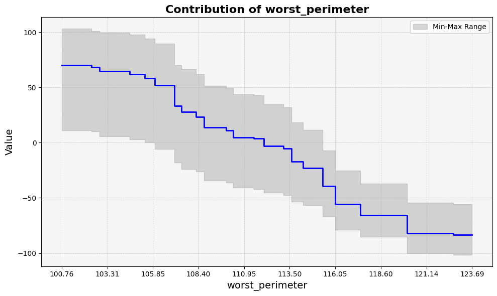

feature_plot
============

.. autofunction:: tree_explainer.plot.feature_plot
    :no-index:

**Example Usage**

Below is an example of how to use the `feature_plot` function:

.. code-block:: python

    from tree_explainer import Explainer
    from tree_explainer.plot import feature_plot

    # Assume 'model' is a trained LightGBM or XGBoost model object

    # Create an instance of the Explainer
    explainer = Explainer()
    explainer(model)

    # Analyze the specified feature by its index
    df = tree.analyze_feature(22)

    # Plot the feature using a line plot
    feature_plot(df)

**Output**

